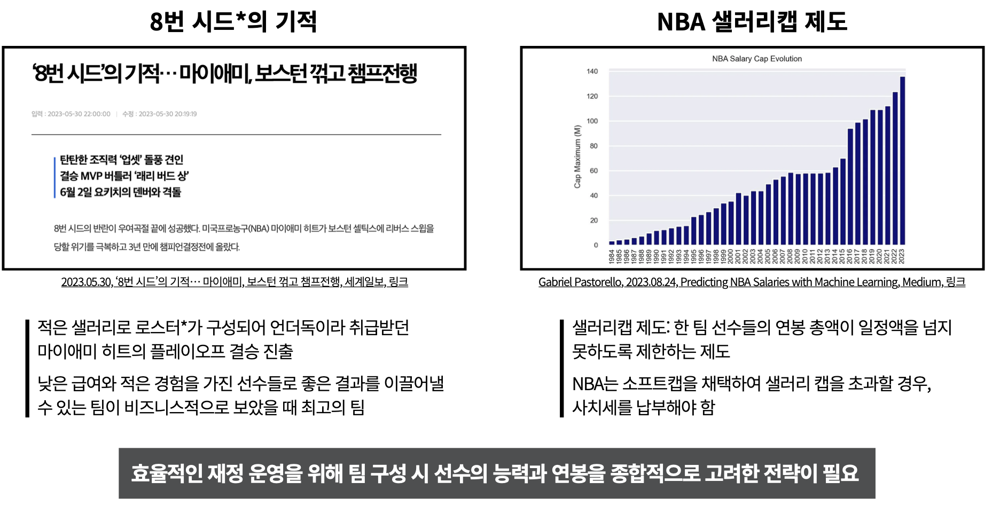
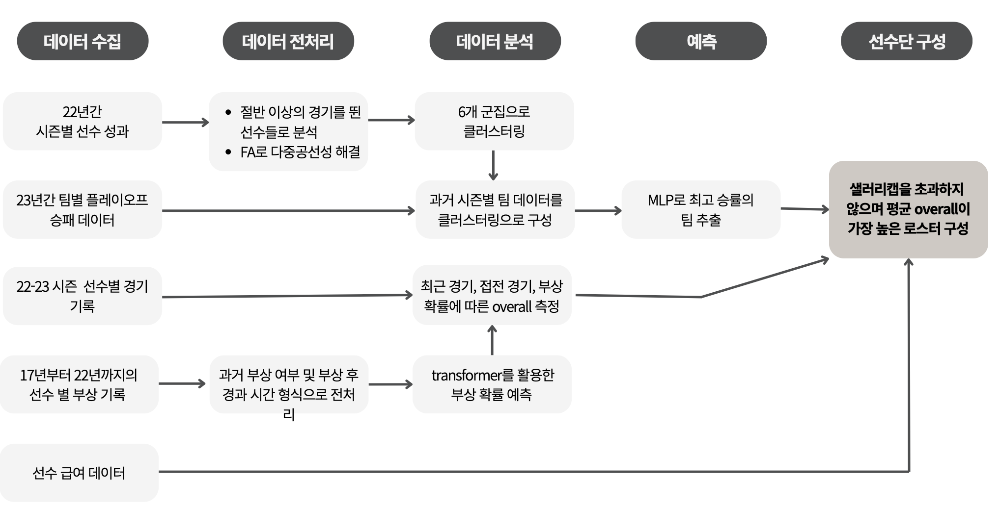
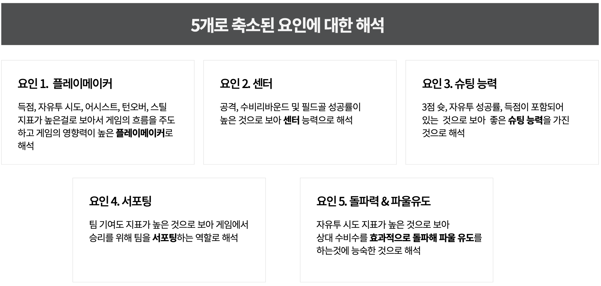
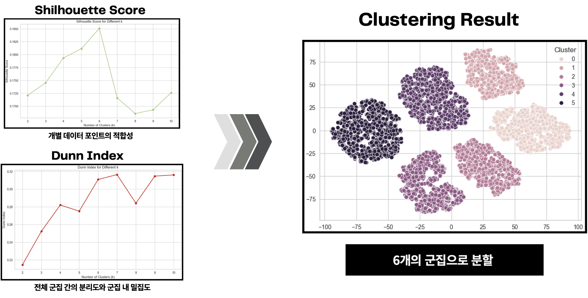
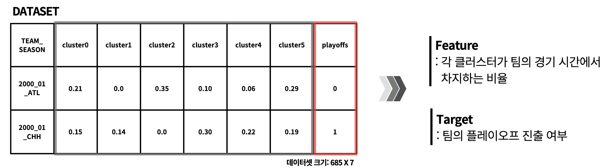
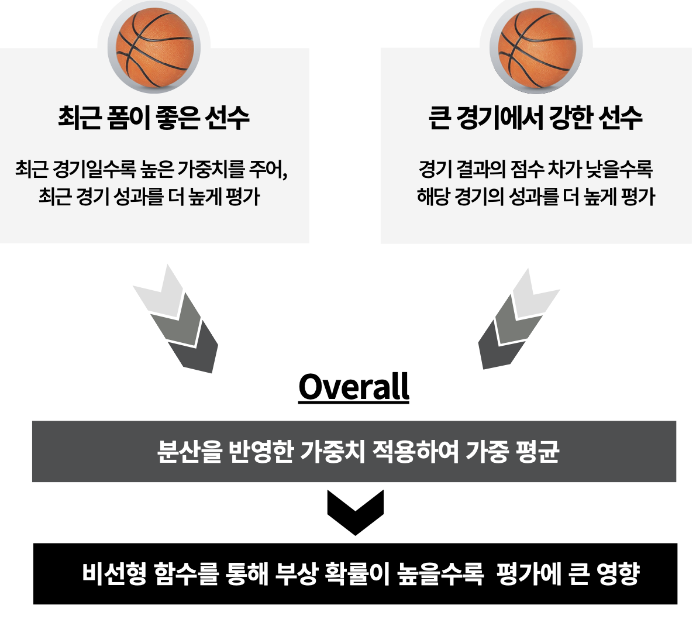
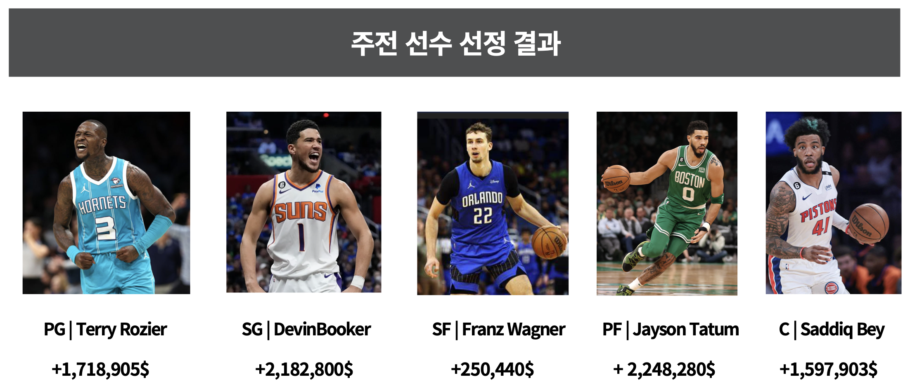
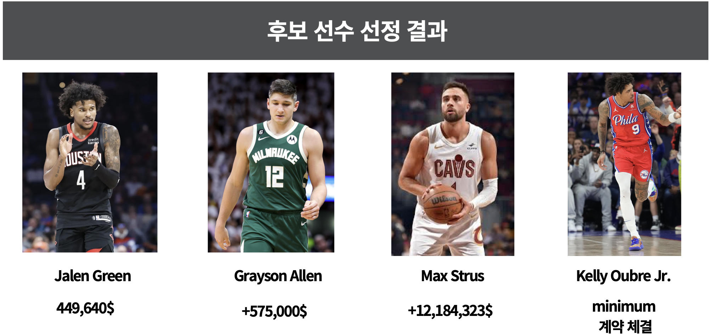

# 데이터 기반 NBA 팀 구성 최적화

## Project Start
본 프로젝트는 **NBA 팀 구성 최적화**를 목표로 하며, 선수 성과 및 부상 리스크를 고려하여 데이터 기반으로 최적의 로스터를 구성하는 연구를 수행했습니다. 현대 농구에서 **샐러리캡 제도와 경기력 극대화**가 중요한 요소인 만큼, 이를 고려한 팀 구성 전략을 제시합니다.

## 연구 목표
- **선수 성과 및 부상 리스크를 반영한 팀 최적화**
- **데이터 분석 및 머신러닝 기법을 활용한 팀 구성 개선**
- **샐러리캡 내에서 최적의 선수 조합을 찾는 최적화 기법 적용**

## 데이터 설명
- **Official NBA Stats**: 2001-02 시즌부터 2022-23 시즌 성과 데이터
- **선수 급여 데이터**: 2022-23 시즌 선수 급여 데이터
- **선수 부상 데이터**: 2017~22 5년간 선수 부상 데이터

### 주요 데이터 변수
- **경기 성과 지표**: 득점(PTS), 리바운드(OREB, DREB), 어시스트(AST), 턴오버(TOV), 스틸(STL), 블록(BLK), 슛 성공률(FG%, 3P%, FT%)
- **부상 데이터**: 선수별 시즌별 부상 이력 및 회복 기간
- **급여 데이터**: 선수 연봉 및 샐러리캡 제한
- **팀 데이터**: 시즌별 팀 성적 및 플레이오프 진출 여부

## 파이프라인

## 분석 과정
### 1. 선수 성과 데이터 전처리 및 요인 분석
- **차원의 저주 해결**
  - NBA 특성 고려(효율성 중시)
  - 희소 데이터 열 제거
- 데이터의 다중공선성을 해결하고 변수 차원을 축소하기 위해 **요인 분석(Factor Analysis, FA)**을 적용
  - 요인 해석을 위한 Varimax 회전 적용
- **5개 주요 요인 도출**
  - **Playmaker Skill**: 득점, 어시스트, 턴오버
  - **Center Skill**: 리바운드, 블록슛
  - **Shooting Skill**: 야투율, 3점슛 성공률, 자유투 성공률
  - **Contribution**: 팀 공헌도(+/-)
  - **FreeThrow Opportunity**: 돌파력 및 파울 유도 능력

### 2. 선수 유형 분류를 위한 군집 분석
- 요인 분석 결과를 기반으로 선수들을 유형별로 분류하기 위해 **K-Means 군집 분석** 수행
- **Silhouette Score 및 Dunn Index**를 이용해 최적 군집 개수 결정 (6개 군집)

- **각 군집의 해석**
  - **Cluster 0**: 전략적 수비형 가드
  - **Cluster 1**: 후보 센터
  - **Cluster 2**: 엘리트 가드 및 포워드
  - **Cluster 3**: 핵심 리더 및 득점원
  - **Cluster 4**: 전통 센터
  - **Cluster 5**: 전략적 외곽 슈터

### 3. 플레이오프 진출 가능성 예측 (MLP 모델)
- **다층 퍼셉트론(MLP) 모델**을 사용하여 팀 구성이 플레이오프 진출에 미치는 영향을 학습
- **입력 변수**: 각 팀의 군집별 경기 시간 비율, 해당 시즌 플레이오프 진출 여부
- **목표**: 플레이오프 진출 여부 예측(이진 분류)

- **최적화된 모델 성능**
  - **Precision**: 0.7931
  - **최종 예측 확률 0.65 이상을 최적 조합 기준으로 설정**

### 4. 최적화 기법을 활용한 팀 조합 탐색
- **Simulated Annealing (시뮬레이티드 어닐링) 최적화 알고리즘**을 사용하여 최적의 로스터 비율 탐색
- 초기 기준(EDA를 활용한 합리적 선택)
  - **주전 5명(65% 출전시간), 후보 4명(35% 출전시간)**
  - 각 군집에 최소 1명의 선수를 포함
  - 플레이오프 진출 확률이 가장 높은 조합을 찾도록 최적화 수행

### 5. 선수 평가 및 부상 예측 모델링

- **회귀 분석을 활용한 선수 가치 평가**
  - 종속변수: 선수 공헌도(+/-)
  - 유의미한 독립변수 선별하여 선수별 성과 평가
  - 최근 경기 가중치 적용: 최신 경기일수록 더 높은 영향을 주도록 **지수 평활법(Exponential Smoothing, α=0.7)**을 사용하여 가중치 적용
  - 접전 경기 가중치 적용: 경기 종료 시 점수 차가 적을수록 중요도가 높다고 판단하여, 점수 차이를 반비례 관계로 변환하여 가중치 산출

- **Transformer 모델을 활용한 부상 예측**
  - 선수 경기 성과 및 부상 이력 데이터를 기반으로 Transformer 인코더 구조 적용
  - 검증 데이터 정확도: **81.4%** / 테스트 데이터 정확도: **78.5%**
  - 부상 확률을 선수 평가(overall) 점수에 반영하여 최종 점수 조정 (부상 확률이 높은 선수의 overall 점수를 log 스케일을 적용하여 감소) (부상 확률이 높은 선수의 overall 점수를 log 스케일을 적용하여 감소)

### 6. 최종 로스터 구성 및 샐러리캡 고려
- 최적의 조합을 찾기 위해 **선수 급여 데이터를 반영한 최적화 수행**
- 샐러리캡($134,000,000) 내에서 가장 높은 overall을 기록하는 조합 선택
- **최종 로스터 구성 결과**
  - 평균 연봉: **$114,734,600 (샐러리캡 준수)**
  - 선수 평균 성과 향상 확인
  - 주요 선수 계약 연장 및 트레이드 정보 반영

## 결과 및 결론
- 본 연구를 통해 **샐러리캡을 초과하지 않으면서도 최적의 선수 조합을 구성할 수 있음을 검증**
- **군집 분석을 활용한 포지션 초월적 팀 구성 가능성 확인**
- **딥러닝 및 최적화 알고리즘을 활용한 새로운 분석 프레임워크 제시**
- 부상 리스크까지 반영한 팀 구성 전략이 실제 경기 성과에 긍정적인 영향을 줄 수 있음을 입증

## 향후 연구 방향
- **팀 전술적 요소 추가 반영** (예: 특정 코치 스타일, 경기 템포 분석)
- **실제 NBA 시즌과 비교하여 예측 정확도 검증**
- **강화학습 기반 팀 최적화 적용 가능성 탐색**
